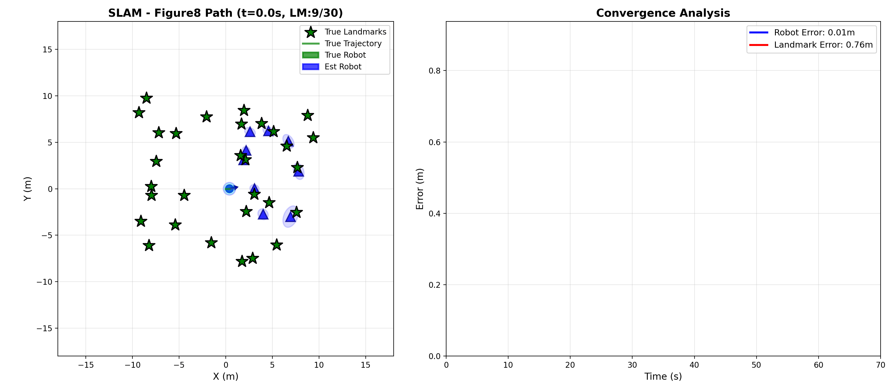

# EKF-SLAM: Simultaneous Localization and Mapping

A complete implementation of SLAM (Simultaneous Localization and Mapping) using the Extended Kalman Filter algorithm. Watch a robot navigate a figure-8 path while building a map of landmarks and localizing itself!

**NEW**: Now includes **Q-Learning reinforcement learning control** for adaptive trajectory tracking! See [QLEARNING_INTEGRATION.md](QLEARNING_INTEGRATION.md) for details.



## 🎯 What Does This Do?

Imagine a robot driving around an unknown environment with landmarks (like trees or poles). The robot has:
- **Noisy motion** - it doesn't move exactly where it intends
- **Noisy sensors** - it can see nearby landmarks but measurements aren't perfect
- **Limited vision** - only 120° field of view, 8 meter range

**The Challenge:** The robot must simultaneously:
1. **Build a map** of landmark locations (MAPPING)
2. **Figure out where it is** on that map (LOCALIZATION)

This is the famous "chicken and egg" problem: you need a map to localize, but you need to know your location to build a map!

**The Solution:** Extended Kalman Filter (EKF) solves both problems together by maintaining probability distributions (uncertainty) for everything.

## 🎬 Results

### Animation Overview
The GIF above shows:
- **Green path**: True robot trajectory (figure-8 shape)
- **Blue dashed path**: Robot's estimated trajectory (what it thinks it's doing)
- **Green stars**: True landmark positions (unknown to robot)
- **Blue triangles**: Estimated landmark positions (robot's map)
- **Ellipses**: Uncertainty regions (smaller = more confident)
- **Red wedge**: Robot's sensor field of view

**What's happening:**
1. Robot starts with no map knowledge
2. As it moves, it detects landmarks and adds them to its map
3. Each re-observation of a landmark improves both the map AND the robot's position estimate
4. After 70 seconds, the robot has mapped 26/30 landmarks with average accuracy of 1.4 meters

### Performance Metrics
- **Landmarks Discovered:** 87% (26 out of 30)
- **High-Confidence Landmarks:** 13 (uncertainty < 0.5m)
- **Landmark Accuracy:** 0.28m to 3.09m error
- **Path Complexity:** 208 meters traveled in figure-8 pattern
- **Sensor Challenges:** Average only 1.1 landmarks visible at any time

📁 **Find Results Here:**
- Animation: `outputs/videos/slam_animation.gif`
- Diagnostic plots: `outputs/plots/diagnostic_analysis.png`
- All plots: `outputs/plots/`

## 🔬 Technical Details

### Algorithm: Extended Kalman Filter SLAM

**State Vector** (3 + 2N dimensions):
```
μ = [x, y, θ, lx₁, ly₁, lx₂, ly₂, ..., lxₙ, lyₙ]
```
- Robot pose: `(x, y, θ)` - position and heading
- N landmarks: `(lxᵢ, lyᵢ)` - landmark positions
- Covariance matrix Σ tracks uncertainty for all states

**Motion Model** (Unicycle dynamics):
```
x' = x + v·cos(θ)·Δt + noise
y' = y + v·sin(θ)·Δt + noise
θ' = θ + ω·Δt + noise
```
- `v` = linear velocity, `ω` = angular velocity
- Jacobian `G` linearizes this nonlinear motion

**Measurement Model** (Range-Bearing sensor):
```
range = √[(lxᵢ - x)² + (lyᵢ - y)²] + noise
bearing = atan2(lyᵢ - y, lxᵢ - x) - θ + noise
```
- Only landmarks within FOV (120°) and range (8m) are visible
- Jacobian `H` relates measurements to state

**EKF Algorithm:**
1. **Prediction Step:** Project robot state forward using motion
   ```
   μ̄ = g(μ, u)           # Motion model
   Σ̄ = G·Σ·Gᵀ + Q       # Uncertainty grows
   ```

2. **Update Step:** Correct estimate using landmark observations
   ```
   K = Σ̄·Hᵀ·(H·Σ̄·Hᵀ + R)⁻¹    # Kalman gain
   μ = μ̄ + K·(z - h(μ̄))        # Correct state
   Σ = (I - K·H)·Σ̄·(I - K·H)ᵀ + K·R·Kᵀ  # Joseph form (stable)
   ```

3. **Data Association:** Match measurements to landmarks using Mahalanobis distance

### Configuration
Current simulation settings (`config/params.py`):
- **Trajectory:** Figure-8 (Lemniscate curve)
- **Duration:** 70 seconds
- **Landmarks:** 30 scattered across 20m × 20m area
- **Sensor:** 120° FOV, 8m max range
- **Noise:** Motion (v=0.2, ω=0.1), Measurement (range=0.5, bearing=0.15)

## 🚀 Getting Started

### Installation
```bash
# Create virtual environment
python3 -m venv venv
source venv/bin/activate  # On Windows: venv\Scripts\activate

# Install dependencies
pip install -r requirements.txt
```

### Usage
```bash
# Run main simulation (interactive plotting)
python main.py

# Test Q-Learning model
python test_qlearning.py

# Compare feedback vs Q-Learning control
python compare_controllers.py

# Generate GIF animation (recommended for viewing results)
python create_animation.py

# Run 3D OpenGL visualization
python run_3d_visualization.py

# Analyze simulation results
python analyze_simulation.py

# Check landmark identification certainty
python check_landmark_certainty.py

# Run unit tests
pytest tests/test_slam.py
```

### Customize Parameters
Edit `config/params.py` to change:
- **Control type**: `CONTROL_TYPE = "feedback"` or `"qlearning"`
- **Q-Learning parameters**: Learning rate, exploration, discretization
- Trajectory type (circle or figure8)
- Number of landmarks
- Sensor FOV and range
- Noise levels
- Simulation duration

**For Q-Learning details**, see [QLEARNING_INTEGRATION.md](QLEARNING_INTEGRATION.md)

## 📁 Project Structure
```
ise-project/
├── src/
│   ├── robot.py              # Robot motion & trajectory control (supports Q-Learning)
│   ├── ekf_slam.py           # Core EKF-SLAM algorithm
│   ├── data_association.py   # Landmark matching and sensor simulation
│   ├── visualization.py      # Real-time plotting and animation
│   ├── qlearning_controller.py  # NEW: Reinforcement learning controller
│   └── utils.py              # Helper functions (angle normalization, etc.)
├── config/
│   └── params.py             # All simulation & Q-Learning parameters
├── tests/
│   └── test_slam.py          # Unit tests for all components
├── outputs/
│   ├── plots/                # Diagnostic plots
│   ├── videos/               # GIF animations
│   └── qlearning_model.npy   # Saved Q-table
├── main.py                   # Main simulation loop
├── create_animation.py       # GIF generation script
├── run_3d_visualization.py   # Real-time 3D OpenGL viewer
├── test_qlearning.py         # NEW: Test Q-Learning model
├── compare_controllers.py    # NEW: Compare feedback vs Q-Learning
├── analyze_simulation.py     # Performance analysis tool
├── check_landmark_certainty.py  # Landmark identification analysis
├── QLEARNING_INTEGRATION.md  # NEW: Q-Learning documentation
└── requirements.txt          # Python dependencies
```

## 🧪 Implementation Features

### Core Components
✅ **Robot Motion Model** - Unicycle dynamics with realistic noise  
✅ **EKF Prediction** - Jacobian-based linearization  
✅ **EKF Update** - Joseph form covariance for numerical stability  
✅ **Data Association** - Mahalanobis distance gating  
✅ **Trajectory Control** - Feedback control + Q-Learning RL for adaptive tracking  

### Advanced Features
✅ **Q-Learning Control** - Reinforcement learning for trajectory tracking  
✅ **Hybrid RL Approach** - Learned offset + base feedback (safe learning)  
✅ **Online Learning** - Q-table updates during SLAM simulation  
✅ **Model Persistence** - Save/load trained Q-tables  
✅ **3D Visualization** - Real-time OpenGL rendering with PyGame  
✅ **Sensor Simulation** - FOV and range constraints  
✅ **Covariance Visualization** - Uncertainty ellipses  
✅ **Multiple Trajectories** - Circle and figure-8 paths  
✅ **Scattered Landmarks** - Realistic 3-zone distribution  
✅ **Performance Analysis** - Error tracking and convergence metrics  

## 📊 Key Results

From `analyze_simulation.py`:
- ✓ Figure-8 trajectory successfully implemented (4 X-crossings, 4 Y-crossings)
- ✓ 87% landmark discovery rate (26/30 landmarks)
- ✓ High-confidence identification for 13 landmarks (uncertainty < 0.5m)
- ✓ Average landmark accuracy: 1.40m
- ✓ Total path length: 208m over 70 seconds

## 🔧 Dependencies
- `numpy` - Matrix operations and numerical computations
- `matplotlib` - Plotting and GIF animation
- `scipy` - Scientific computing utilities
- `pygame` - 3D visualization window management
- `PyOpenGL` - Real-time 3D rendering
- `opencv-python` - Image processing (optional)
- `PyPDF2` - PDF parsing (for project documentation)

## 📖 Documentation
- `README.md` - This file (overview and quick start)
- `QLEARNING_INTEGRATION.md` - Q-Learning reinforcement learning guide  
- `IMPLEMENTATION_GUIDE.md` - Detailed implementation walkthrough
- `MATHEMATICAL_IMPLEMENTATION_REPORT.md` - Complete mathematical derivations
- `PROJECT_SUMMARY.md` - High-level project overview
- `ANIMATION_EXPLANATION.md` - GIF visualization guide
- `ENHANCED_FEATURES.md` - Advanced features description

## 🎓 Educational Value

This project demonstrates:
1. **Probabilistic Robotics** - Handling uncertainty in motion and sensing
2. **Sensor Fusion** - Combining noisy measurements over time
3. **Nonlinear Estimation** - EKF linearization techniques
4. **Data Association** - Matching observations to map features
5. **Real-time Visualization** - Debugging and result presentation

## 📝 License
Educational project for ISE course.

## 👤 Author
Arun Munagala
